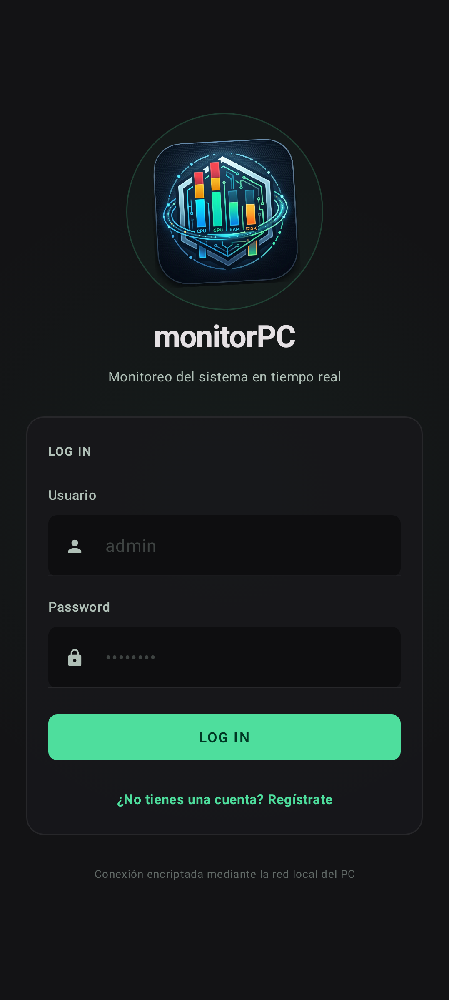
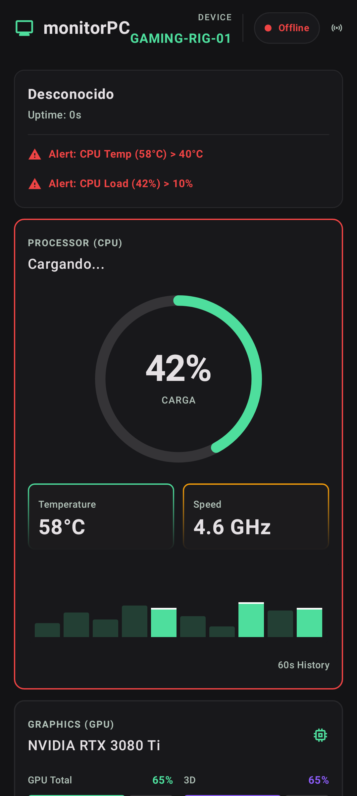
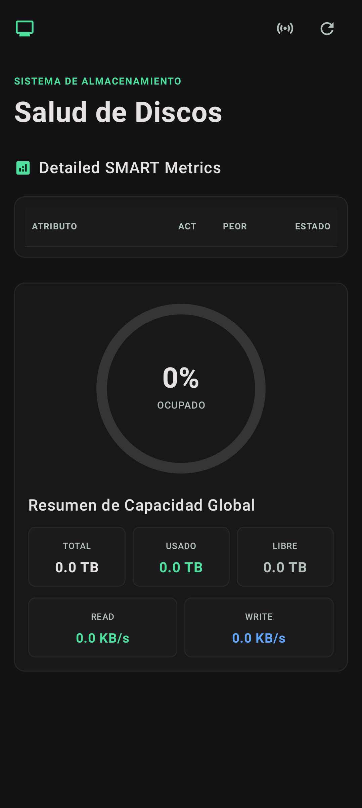
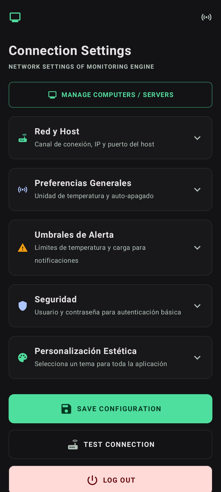

# MonitorPC Basic 📱💻

---

**MonitorPC Basic** es una aplicación móvil minimalista e intuitiva para Android que te permite monitorear las métricas de rendimiento y hardware de tu computadora en tiempo real desde tu dispositivo móvil. 

Esta aplicación ha sido diseñada para ser ligera, rápida y proporcionar una visualización de datos fluida e interactiva.

---

## 📸 Screenshots

<div align="center">
  
  
  
  
</div>

---

## 🚀 Características Principales

*   **⚡ Monitoreo de CPU**: Carga general, velocidad de reloj actual, voltaje, temperatura por núcleo y gráficos de fluctuación histórica en tiempo real.
*   **🎮 Telemetría de GPU**: Visualización del modelo de GPU, carga 3D, temperatura, uso de VRAM (usado vs. total) y estado de los encoders/decoders de video.
*   **💾 Memoria RAM**: Uso detallado en Gigabytes con historial gráfico de ocupación.
*   **📶 Conectividad y Red**: Medición de latencia de red, velocidad de subida/bajada actual y estado de la red local.
*   **📁 Almacenamiento y Diagnóstico S.M.A.R.T.**: Estado de vida útil de tus unidades de almacenamiento (SSD, NVMe, HDD), temperatura de los discos, espacio ocupado/libre y datos S.M.A.R.T. detallados.
*   **⚙️ Control de Procesos Activos**: Búsqueda e inspección de procesos del sistema remoto con su respectivo consumo de CPU y memoria.
*   **📜 Ejecución de Scripts**: Lanzamiento de comandos y scripts automatizados de forma remota.
*   **🖥️ Mirroring de Pantalla**: Transmisión rápida de la pantalla de tu PC a la app móvil por WebSocket.

---

## 📦 Descargas (Releases)

**Última Versión: 1.0.2** 🚀

### Novedades en v1.0.2:
*   **Corrección de Errores Críticos**: Solucionado error de referencia en `SettingsScreen` que impedía la compilación.
*   **Mejoras de UI**: Ajustes en la disposición de tarjetas y manejo de estados expandibles en pantallas anchas.
*   **Estabilidad**: Optimización en el cierre de scopes de Compose y manejo de recursos.
*   **Localización**: Mejoras en las traducciones y consistencia de textos.

Para probar la aplicación rápidamente:
1. Ve a la sección de **[Releases](https://github.com/Yokerman41/monitorpc-basic-android/releases/tag/v1.0.2)**.
2. Descarga el archivo `monitorPC-Basic-v1.0.2.apk` e instálalo en tu Android.
3. Asegúrate de tener el **[monitorpc-agent v1.0.2](https://github.com/Yokerman41/monitorpc-agent/releases/tag/v1.0.2)** corriendo en tu PC.

---

## 🤝 Ecosistema y Funcionamiento con el Agente

Esta aplicación de Android actúa como la interfaz cliente y **requiere del agente de escritorio** para recibir los datos de hardware. 

El agente es un servidor local seguro escrito en Python que recopila la telemetría del sistema y la expone mediante servicios HTTP y WebSockets locales.

🔗 **Enlace al repositorio del Agente**:
👉 **[monitorpc-agent](https://github.com/Yokerman41/monitorpc-agent)**

---

## 🤖 Colaboración con Agente de IA

> [!NOTE]
> Este proyecto, su arquitectura, optimización de hilos y depuración de la conexión mediante WebSockets y REST han sido desarrollados en colaboración directa con **Antigravity**, un agente avanzado de inteligencia artificial diseñado por el equipo de **Google DeepMind**.

---

## 🛠️ Instalación para Desarrolladores

### Configuración del Proyecto:

1.  **Clonar e Importar**:
    Abre Android Studio, selecciona **Open** y elige la carpeta de este proyecto.
2.  **Configurar Variables de Env**:
    Crea un archivo llamado `.env` en el directorio raíz y define:
    ```env
    GEMINI_API_KEY=tu_clave_de_gemini_aqui
    ```
3.  **Ejecutar**:
    Conecta tu dispositivo y haz clic en **Run**.

---

## 📡 Establecer Conexión

1.  Inicia el agente **monitorpc-agent** en tu computadora.
2.  Abre la aplicación de Android.
3.  Introduce la dirección IP local de tu computadora y el puerto (por defecto `8765`).
4.  ¡Listo! Métricas en tiempo real en tu mano.
